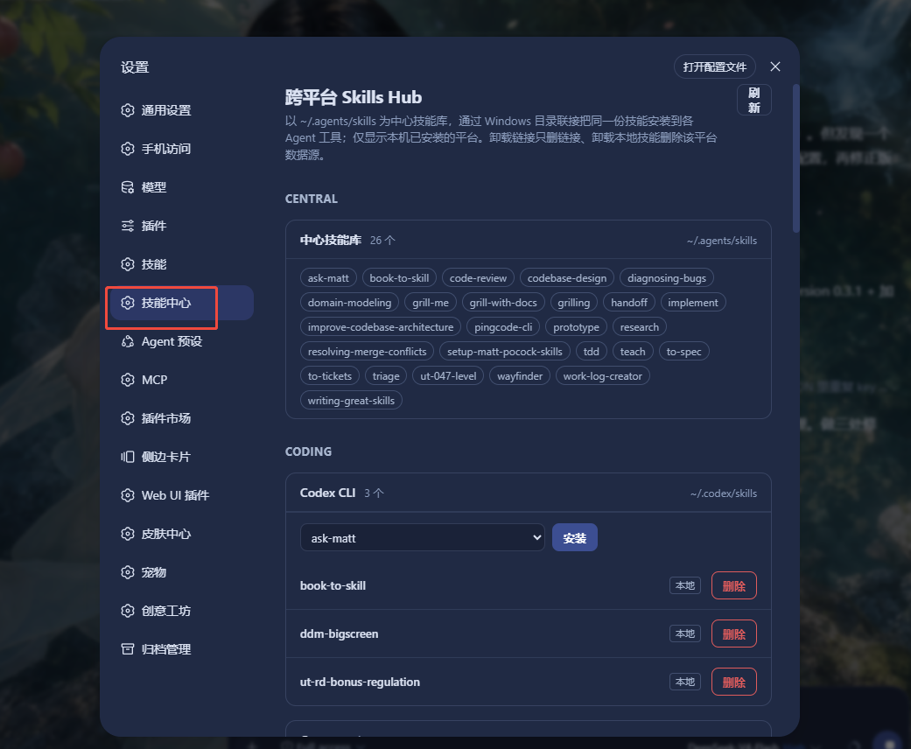
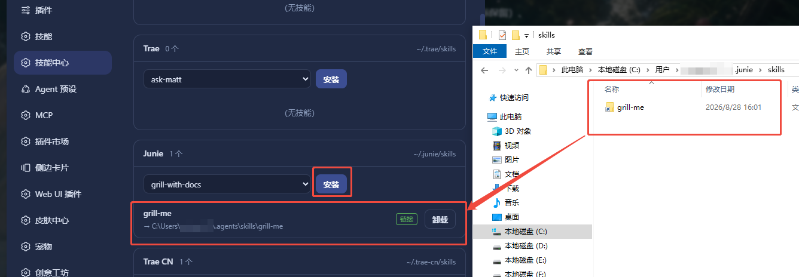
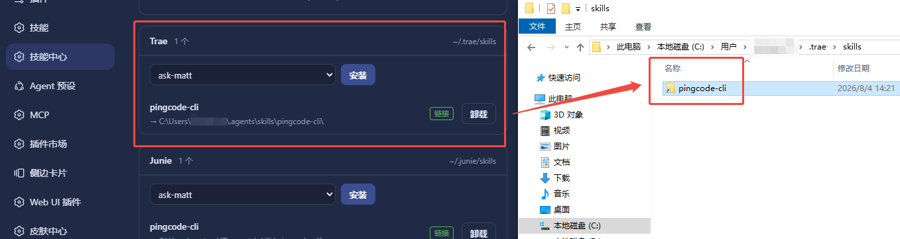
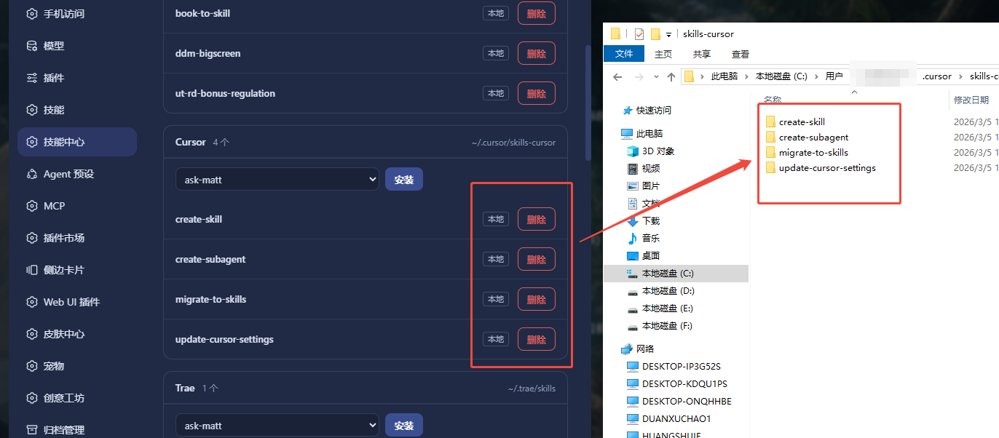

# dsh-skills-hub

[](https://www.npmjs.com/package/dsh-skills-hub)

> **中文版:** [README.zh.md](./README.zh.md)

Cross-platform AI Skills manager for the [DeepSeek Harness](https://github.com/deepseek-ai/dsh) (DSH).

Install one skill from the central skills library `~/.agents/skills` into multiple agent tools (Claude Code, Cursor, Codex, Gemini CLI, Trae, Windsurf, Qoder, CodeBuddy, ...) via system symbolic links — one source of truth driving many coding agents.

> One source of truth, driving many AI coding tools.

## Supported Operating Systems

| OS | Link type | Privileges |
|---|---|---|
| **Windows** | Directory Junction | No admin required |
| **macOS** | Directory symlink | No admin required |
| **Linux** | Directory symlink | No admin required |

Zero third-party runtime dependencies (Node.js built-ins only). DSH runs on Windows / macOS / Linux, so this plugin works across all three.

## Features

- Central skills library management over `~/.agents/skills`.
- Only installed platforms are shown: 26 common agent tool directory mappings are built in; scan filters to what actually exists on this machine.
- One-click install of any central skill into an agent platform via symbolic links (no admin rights required).
- Uninstall semantics:
  - **Link entry** (pointing at the central library) → remove the link only, keep the data source.
  - **Local skill** (the agent tool's own real directory) → delete that platform's data source.
- Read-only platforms (e.g. Claude Code) are shown without write actions.
- Custom platforms: add any local skills directory in Settings, persisted to `~/.skillsmanage/config.json`.
- Local-first, no database: metadata is scanned live from the filesystem.

## Screenshots

**Settings → 技能中心 (Skills Hub)** — the central skills library and platform cards, grouped by category; only platforms installed on this machine are shown.

<p align="center">
  
</p>

Install a central skill into a platform — a link is created pointing back to the central library:

<p align="center">
  
</p>

Uninstall a **link** entry — removes the link only, the central data source stays untouched:

<p align="center">
  
</p>

Delete a **local** skill — removes that platform's own data source:

<p align="center">
  
</p>

## Requirements

| Requirement | Minimum |
|---|---|
| OS | Windows / macOS / Linux |
| Node.js | **>= 20** (`engines` in `package.json`) |
| DSH (DeepSeek Harness) | installed, `dsh` command on PATH |
| pnpm | installed (used by `dsh plugin` internally) |

The plugin itself runs with zero runtime dependencies; Node.js is provided by the DSH host process.

## Install

### Prerequisites

- **DeepSeek Harness (DSH)** installed, with the `dsh` command on PATH.
- **pnpm** installed:

  ```bash
  npm install -g pnpm
  ```

### Option 1: One-click install script (recommended)

Run inside the repository root:

**Windows (PowerShell)**

```powershell
powershell -ExecutionPolicy Bypass -File scripts/install.ps1
# or
pwsh scripts/install.ps1
```

**macOS / Linux**

```bash
bash scripts/install.sh
```

The script runs `dsh plugin --profile web add <this directory>` — pnpm-installs and mounts the plugin automatically; no manual configuration.

### Option 2: `dsh plugin add`

**From local source (in the repository root):**

```bash
dsh plugin --profile web add .
```

**From npm:**

```bash
dsh plugin --profile web add dsh-skills-hub
```

> `dsh plugin add` automatically appends packages that declare `dsh.bundle.patch` to `dsh.profile.bundles` and applies the plugin's own `cordis.patch.yml` — no manual profile edits. Re-run the same command to upgrade.

### Option 3: Manual (development)

```bash
# 1. Edit ~/.dsh/profiles/web/package.json
#    add to dependencies:  "dsh-skills-hub": "link:<absolute path>"
# 2. Install in the profile directory
cd ~/.dsh/profiles/web
pnpm install
```

> After any install method, **restart DSH** for the plugin to take effect.

## Usage

Open DSH **Settings → 技能中心 (Skills Hub)**:

- Platforms are grouped by category (Central / Coding / Lobster / Custom); only platforms actually installed on this machine are shown.
- The central library card lists all available skills (data source, never deleted).
- Each agent platform card lists its skills (badged "link" vs "local") with an install dropdown:
  - Link entry → 「卸载」(uninstall) button (removes the link only).
  - Local entry → 「删除」(delete) button (deletes that platform's data source).
- Add custom platforms at the bottom (directory path + optional display name).

## Platform Mapping

Built-in mapping (conventional directories; only platforms that exist on this machine are displayed):

| Category | Platform | Skills directory | Writable |
|---|---|---|---|
| Central | Central library | `~/.agents/skills` | data source |
| Coding | Claude Code | `~/.claude/skills` | read-only |
| Coding | Codex CLI | `~/.codex/skills` | ✅ (excludes `.system`) |
| Coding | Cursor | `~/.cursor/skills-cursor` | ✅ |
| Coding | Gemini CLI | `~/.gemini/skills` | ✅ |
| Coding | Trae | `~/.trae/skills` | ✅ |
| Coding | Factory Droid | `~/.factory/skills` | ✅ |
| Coding | Junie | `~/.junie/skills` | ✅ |
| Coding | Qwen | `~/.qwen/skills` | ✅ |
| Coding | Trae CN | `~/.trae-cn/skills` | ✅ |
| Coding | Windsurf | `~/.windsurf/skills` | ✅ |
| Coding | Qoder | `~/.qoder/skills` | ✅ |
| Coding | Augment | `~/.augment/skills` | ✅ |
| Coding | OpenCode | `~/.opencode/skills` | ✅ |
| Coding | KiloCode | `~/.kilocode/skills` | ✅ |
| Coding | OB1 | `~/.ob1/skills` | ✅ |
| Coding | Amp | `~/.amp/skills` | ✅ |
| Coding | Kiro | `~/.kiro/skills` | ✅ |
| Coding | CodeBuddy | `~/.codebuddy/skills` | ✅ |
| Coding | Hermes | `~/.hermes/skills` | ✅ |
| Coding | Copilot | `~/.copilot/skills` | ✅ |
| Coding | Aider | `~/.aider/skills` | ✅ |
| Lobster | OpenClaw | `~/.openclaw/skills` | ✅ |
| Lobster | QClaw | `~/.qclaw/skills` | ✅ |
| Lobster | AutoClaw | `~/.openclaw-autoclaw/skills` | ✅ |
| Lobster | WorkBuddy | `~/.workbuddy/skills-marketplace/skills` | ✅ |

> The built-in mapping lives in the `PLATFORMS` constant in `lib/index.js` — edit it to add/remove platforms, or add custom platforms in the Settings UI (persisted to `~/.skillsmanage/config.json`).

## Project Structure

```
dsh-skills-hub/
├── package.json          # plugin manifest (dsh.client / dsh.bundle.patch)
├── cordis.patch.yml      # bundle patch (insert entry, applied automatically by dsh plugin add)
├── lib/
│   ├── index.js          # Host half: node:fs symlinks + webServer routes
│   └── client.js         # Client half: settings UI (__ModuleLoader__.load)
├── scripts/
│   ├── install.ps1       # Windows one-click install script
│   └── install.sh        # macOS / Linux one-click install script
├── test/core.test.js     # unit tests (link primitives + uninstall semantics + cross-platform link type)
├── README.md             # this file (English)
├── README.zh.md          # Chinese translation
├── LICENSE
└── CHANGELOG.md
```

## Security

- Write endpoints accept loopback Host only (`localhost` / `127.0.0.1`) and require a custom marker header (DNS rebinding protection).
- Skill names are whitelisted `[a-zA-Z0-9._-]` (no path traversal).
- The central library itself is never deleted; link removal never touches the data source.
- Deleting a local real directory is an explicit user action, shown as a red 「删除」 button distinct from link 「卸载」.

## License

MIT
